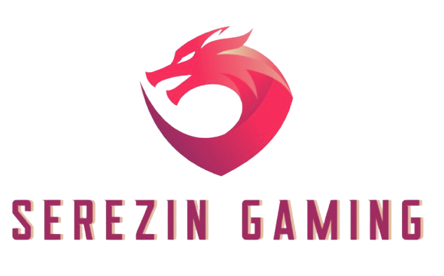

# Serezin Gaming - Tournament Manager for League of Legends



Welcome to **Serezin Gaming**, a platform designed to create and manage tournaments for **League of Legends**. This project streamlines the process of organizing competitive events, providing both front-end and back-end solutions.

- **Back-end Repository**: [Serezin Gaming API](https://github.com/esgi-insomniak/serezin-gaming-api)
- **Front-end Repository**: [Serezin Gaming Client](https://github.com/esgi-insomniak/serezin-gaming-client)

---

## Table of Contents

1. [Features](#features)
2. [Best Practices](./src/docs/best-pratices.md)
3. [Git Hooks and Commit Guidelines](./src/docs/commitizen.md)
4. [Issues](./src/docs/issues.md)
5. [Contributing](#contributing)

---

## Features

- **Tournament Creation**: Create tournaments with customizable settings.
- **Player Management**: Add and manage players and teams.
- **Match Scheduling**: Creation of brackets and scheduling of matches.
- **Live Updates**: Real-time match updates and scoreboards.
- **Admin Panel**: Manage tournaments, players, and matches.
- **Live Streaming**: Integration of live-streaming.
- **Leaderboards**: Display rankings and statistics.
- **Predictions**: Allow users to predict match outcomes, champion picks, etc.

---

## Architecture

```
.
├── public -> public folder
├── src
│    ├── assets
│    ├── components
│    │      └── ui -> shadcn ui components
│    ├── docs -> all documentations
│    ├── libs
│    │   ├── api
│    │   │   ├── custom
│    │   │   ├── endpoints
│    │   │   ├── models
│    │   ├── stores
│    ├── pages
│    │   └── public-routes
│    ├── router
└────├── scripts
         └── all of the scritps
```

---

## Installation

1. Clone the repository:

```bash
git clone https://github.com/esgi-insomniak/serezin-gaming-client
```

2. Install dependencies:

```bash
pnpm i
```

3. Install `mkcert` for SSL support:

```bash
brew install mkcert

# in root folder
mkdir .infra
cd .infra
mkcert local.serezin-gaming.com
```

4. Copy environment variables:

```bash
touch .env.development # if you don't have .env.development
touch .env.production # if you don't have .env.production
pnpm run copy:env
```

5. (Not relevant to frontend project) Clone and install the [Readme -> Serezin Gaming API](https://github.com/esgi-insomniak/serezin-gaming-api)
6. Start the development server:

```bash
pnpm run dev
```

---

## Contributing

We welcome contributions to the project! Please follow these steps:

- Fork the repository.
- Create a feature branch (feat/<feature-name>).
- Commit changes using the Conventional Commits format.
- Open a pull request with a detailed description of your changes.
